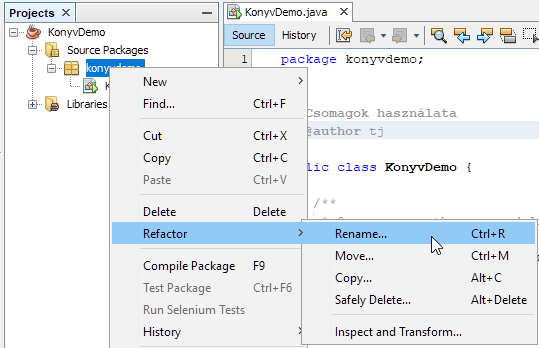
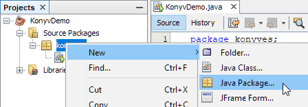
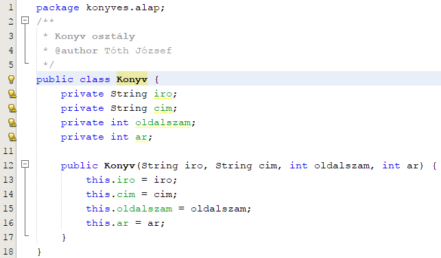
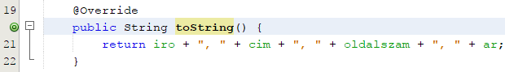
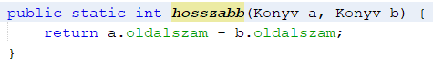
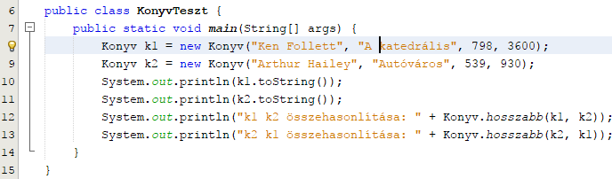

04. Csomagok 1.
===============

Csomagok
--------

Programjaink sok osztályból állhatnak. A Java könyvtár több ezer
osztályt tartalmaz.

Ez az osztályokkal kapcsolatban több problémát is felvet:

-   Hogyan csoportosíthatjuk a logikailag összetartozó osztályokat?

-   Hogyan oldjuk meg, hogy egy osztály ne legyen minden más osztály
    > számára látható, de némelyek számára igen?

-   Hogyan oldjuk meg, hogy osztályok nevei ne ütközzenek?

Ezeket a problémákat úgy oldjuk meg, hogy az osztályokat csomagokba
soroljuk.

A csomagba sorolást az osztálydefiníció elött a forrásfájl első
utasításaként kell megadni:

package csomagnév;

Például:

package sajat;\
public class Proba {\
...\
}

Az osztály csomagba sorolásával funkciók szerint csoportosíthatjuk
osztályainkat. Például külön csomagba tesszük a grafikus felülettel
kapcsolatos osztályokat, külön az adatokat kezelő osztályokat, ...

A Java könyvtárban is csomagokban vannak az osztályok. Például a
javax.swing csomagba tették azokat az osztályokat, amelyek a swing
grafikus felület készítésével kapcsolatosak, java.io csomagba tették az
input-outputtal kapcsolatos osztályokat, java.net csomagba tették a
hálózattal kapcsolatos osztályokat, stb.

Egy csomagnak lehetnek alcsomagjai, de valójában csak a nevek
hierarchikusak, mert az alcsomag ugyanúgy másik csomag, mintha nem
alcsomag lenne.

Tehát lehetséges létrehozni egy proba nevű csomagot és benne egy
proba.valami nevűt. A proba csomagnak alcsomagja a proba.valami, de nem
tartalmazza azt.

Az alcsomag szerepe csak logikai alárendeltség. Például a
javax.swing.table csomag tartalmazza a swing grafikus felületen
használható táblázatokkal kapcsolatos osztályokat.

Az osztály csomagba sorolásával az osztály láthatóságát korlátozhatjuk,
hiszen ha félnyílvánosra definiáljuk (nem írjuk elé a public módosítót),
akkor csak az ugyanabba a csomagba tartozó osztályok láthatják. (Egy
osztály vagy publikus vagy félnyílvános. Csak tagosztály lehet protected
és private.) Az alcsomag is külön csomag, tehát pl. a proba csomagban
levő és a proba.valami csomagban levő félnyílvános osztályok nem látják
egymást.

Az adattagok és a metódusok láthatóságánál is van szerepe a csomagnak,
hiszen egy félnyílvános tag is csak az azonos csomagban levő osztályok
számára látható és egy protected tag is csak azonos csomagban levő
osztályok számára vagy leszármazott osztályok számára látható.

Az osztály csomagba sorolásával a névütközést is megoldjuk, ugyanis az
osztályok teljes neve (hivatkozási neve) csomagnév.osztálynév alakú. Így
két különböző csomagban lehet azonos nevű osztály. (Hasonló, mint más
nyelvekben a névtér fogalom.)

Tulajdonképpen találkoztunk már a teljes névvel, hiszen
a java.util.Scanner osztálynál a csomag neve java.util, az osztály
neve Scanner, az osztály teljes neve a java.util.Scanner.

A teljes név ütközést elkerülendő, az olyan csomagok esetén, amelyek a
nyilvános használatra készültek, a csomagnevekre az a szokás alakult ki,
hogy a fejlesztő cég internetes domain nevének fordítottjával kezdődik.
Például az Eclipse api-jában a következő csomagnevekkel találkozhatunk:
org.eclipse.ui, org.eclipse.core, ...

Ha egy osztályt nem sorolunk csomagba, akkor a névtelen csomagba fog
tartozni. A névtelen csomagot legfeljebb saját célra készült, kisebb
programoknál érdemes használni.

Hivatkozás az osztályokra
-------------------------

Egy osztályra hivatkozni egy **azonos** csomagban levő másik osztályból
lehet akár a teljes névvel, akár pusztán az osztálynévvel is.

Például az a.b csomagban található egy Alma és egy Korte osztály, akkor
a Korte osztályban az Alma osztályra lehet a.b.Alma teljes névvel vagy
csak Alma osztálynévvel is hivatkozni.

Egy osztályra hivatkozni egy **másik** csomagban levő osztályból csak
teljes névvel lehet, kivéve, ha az osztályt importáljuk.

Például az a.b.c csomagban levő Szilva osztályból az Alma osztályra csak
teljes névvel hivatkozhatunkk: a.b.Alma.

Importálás
----------

Egy osztály importálása arra szolgál, hogy az osztályra a teljes neve
helyett csak az osztálynévvel hivatkozhassunk.

Nem szükséges tehát importálni az azonos csomagba tartozó osztályokat,
hiszen azokra amúgy is lehet osztálynévvel hivatkozni.

Más csomagba tartozó osztályokat sem kötelező tehát importálni, csak
kevesebbet kell gépelni, ha importáljuk. Importálás az osztálydefiníció
előtt a csomagdefiníció után lehetséges az\
import teljesosztálynév;\
utasítással.

Tehát egy forrásfájl szerkezete:\
csomag megadás\
import utasítások\
osztálydefiníció

Ha bármelyik osztályban, amelyben használjuk a java.util.Scanner
osztályt, kiírjuk az osztálydefiníció fejléce elé az\
import java.util.Scanner;\
utasítást, akkor a\
java.util.Scanner sc = new java.util.Scanner(System.in);\
utasítás helyett elég a\
Scanner sc = new Scanner(System.in);\
utasítás is.

Importálni nem csak egy osztályt lehet egyszerre, hanem egy csomag
összes osztályát is. Az\
import csomagnév.\*;\
hatása megegyezik azzal, mintha a csomagban levő összes osztályt külön
importáltuk volna, tehát mindegyikre lehet hivatkozni az osztálynévvel.

Minden osztályban automatikusan importálódik a java.lang csomag összes
osztálya. Ebben a csomagban találhatók a nyelv legfontosabb osztályai,
pl. a már eddig is használt String osztály.

Feladat
-------

A lecke anyagát egy könyvekkel kapcsolatos példán fogjuk kipróbálni.

1.  Indítsd el a NetBeans programot, és kezdj egy új projektet KonyvDemo
    néven!

2.  Nevezd át az automatikusan létrehozott csomagot konyves-re!\
    {width="5.613881233595801in"
    height="3.6245472440944884in"}\
    Ez a parancs minden osztályban átírja a csomag nevét. Ellenőrizd a
    KonyvDemo osztályban!

3.  Hozz létre egy alcsomagot a konyves csomagon belül, konyves.alap
    néven!\
    {width="4.666083770778653in"
    height="1.6247965879265092in"}

4.  Készíts egy új, Konyv nevű osztályt a konyves.alap csomagba! Figyeld
    meg az osztály elején a package utasítást!

5.  Készítsd el a Konyv osztály példányváltozóit és konstruktorát az
    alábbiak szerint:\
    {width="6.697916666666667in"
    height="3.9270833333333335in"}

6.  Készíts egy metódust, amely kiírja egy könyv adatait! Ez írja felül
    az örökölt toString() metódust! (Az örökléssel nemsokára
    foglalkozunk.)\
    {width="6.458333333333333in"
    height="0.9270833333333334in"}

7.  Készíts egy metódust, amely összehasonlítja a paraméterként kapott
    > két könyv oldalszámait! Ha az első rövidebb, a visszaadott érték
    > negatív, ha egyenlő hosszúak, akkor 0, egyébként (ha az első
    > hosszabb), akkor pozitív. Ezt a metódust statikus
    > osztálymetódusként készítsd el:\
    > {width="4.948606736657918in"
    > height="0.7501049868766404in"}

8.  Hozz létre egy új teszt csomagot konyves.alap néven!

9.  Hozz létre ebben a csomagban egy KonyvTeszt nevű osztályt!

10. Készítsd el a KonyvTeszt osztály main metódusát:\
    {width="7.166666666666667in"
    height="2.1041666666666665in"}\
    Figyeld meg a statikus metódus hívását! Futtasd a tesztet (jobb
    kattintás, Run File vagy Shift+F6) !

A következő leckében folytatjuk.
