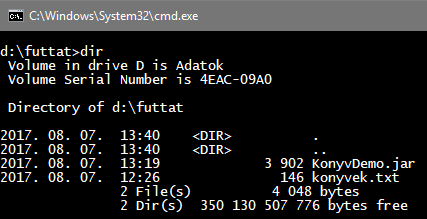

05. Csomagok 2.
===============

Ebben a leckében folytatjuk az előzőben elkezdett könyves feladatot, és
megnézzük, milyen mappákban tárolódik a projekt.

Feladat folytatása
------------------

A KonyvDemo osztályban beolvassuk a *konyvek.txt* fájl tartalmát,
kilistázzuk a képernyőre, majd kiíratjuk a leghosszabb könyv adatait.

1.  Indítsd el a NetBeans programot, és nyisd meg a KonyvDemo projektet!

2.  A könyveket egy listában tároljuk. Készítsd el először ezt:\
    {width="5.302083333333333in"
    height="0.4479166666666667in"}\
    Miért statikus a konyvek változó?

3.  Utána készítsd el a beolvasást!\
    {width="6.25in"
    height="1.8958333333333333in"}\
    Figyeld meg, hogy most a konstruktor hívása előtt szétvágtuk a
    beolvasott sort!

4.  Ezután készítsd el a listázást a képernyőre!\
    {width="4.395833333333333in"
    height="1.0416666666666667in"}\
    Próbáld ki!

5.  Végül keresd meg a legtöbb oldalból álló könyvet, és írasd ki az
    adatait:\
    {width="6.333333333333333in"
    height="2.2916666666666665in"}\
    Futtasd a programot!

Mappák és fájlok
----------------

Most megnézzük, hová menti a NetBeans az osztályokat és a lefordított
fájlokat.

1.  Nyisd meg a NetBeans ablak bal oldali részén a Files fület, amely
    azt mutatja, hogy a projekten belül milyen mappák és fájlok vannak!

2.  Bontsd ki az *src* és a és a *test* mappákat!\
    {width="2.46875in"
    height="3.15625in"}

3.  Figyeld meg, hogy az *src* mappába kerülnek az általunk készített
    osztályok fájljai! A fájlok nevei megegyeznek az osztályok neveivel,
    kiterjesztésük pedig .*java*\
    A csomagok itt a mappáknak felelnek meg. Figyeld meg, hogy a konyves
    mappában van az *alap* mappa! A *KonyvDemo.java* közvetlenül a
    *konyves* mappában van, a *Konyv.java* padig az *alap* mappában.

4.  Nézd meg a *test* mappa tartalmát! Figyeld meg, hogy itt is a mappák
    felelnek meg a csomagoknak, a .*java* kiterjesztésű fájlok pedig az
    osztályoknak.

5.  A program futtatása előtt a NetBeans lefordítja az osztályokat a JVM
    által futtatható byte kódra. A lefordított fájlok neve megegyezik az
    osztályéval, kiterjesztésük .*class*, és a *build/classes*, illetve
    a *test/classes* mappákba kerülnek, a csomagoknak megfelelően.\
    Nézd meg a *build* és a *test* mappák tartalmát!\
    {width="2.8125in" height="3.25in"}

6.  Amennyiben szeretnénk terjeszteni a programunkat, egy .*jar*
    kiterjesztésű fájlt kell előállítanunk, amely a Java futtató
    környezettel (JRE) a NetBeans nélkül is futtatható. A JAR fájl
    előállításához kattints a Clean and Build Project
    {width="0.375in"
    height="0.3229166666666667in"} gombra, vagy nyomd meg a Shift+F11
    billentyűket!\
    Ez letörli az előző fordításkor keletkezett fájlokat, újra lefordít
    minden osztályt, és elkészíti a futtatható JAR fájlt.

7.  A JAR fájlt egy *dist* nevű mappában találod. Keresd meg!\
    {width="1.9583333333333333in"
    height="2.3541666666666665in"}

Futtatás a parancssorból
------------------------

A JAR fájlt parancssorból tudjuk futtatni.

1.  Először készíts egy tetszőleges új mappát, és másold bele a
    *KonyvDemo.jar* és a *konyvek.txt* fájlokat!

2.  Utána nyiss egy Parancssor ablakot, és navigálj ebbe a mappába!\
    {width="4.447916666666667in"
    height="2.28125in"}

3.  A futtatáshoz írd be a következő parancsot:\
    {width="3.4375in"
    height="1.4270833333333333in"}\
    Az eredményből látszik, hogy az ékezetes betűkkel probléma van.
    Sajnos a Windows a parancssorban más karakterkódolást használ.
    Szerencsére a grafikus felületen nem lesz ilyen problémánk.

Parancssori argumentumok
------------------------

Programunk egyelőre csak a *konyvek.txt* fájllal működik. Alakítsuk át
úgy, hogy meg lehessen adni a fájl nevét!

A fájlnevet meg lehet adni úgy, hogy a program megkérdezi, de van egy
másik módszer is. A parancssorban a JAR fájl neve után is megadhatjuk
argumentumként.

Ebben az esetben így indíthatjuk a programot:\
java --jar KonyvDemo.jar konyvek.txt

A parancssori argumentumokat a main metódus kapja meg paraméterként.
Erre szolgál az args nevű string tömb, amely mindig szerepel a main
metódus definíciójában.

Az első argumentum az arg\[0\] elemmel érhető el, a második az
arg\[1\]-gyel, és így tovább.

1.  Ennek megfelelően írd át a main metódus elejét a KonyvDemo
    osztályban:\
    {width="5.822916666666667in"
    height="0.6875in"}

2.  A parancssori argumentumokat a NetBeansben is ki lehet próbálni.
    Ehhez a projekt jobb gombos menüjéből a Properties-t kell
    választani, majd megadni az argumentumokat az alábbi ábra szerint:\
    {width="6.854166666666667in"
    height="4.96875in"}

3.  Futtasd a programot a NetBeansben!

4.  Ezután készítsd el újra a JAR fájlt (Shift+F11), és másold az előbb
    használt mappába!

5.  Végül futtasd le parancssorból is a programot, argumentumként
    megadva a fájlnevet!\
    {width="3.84375in"
    height="1.40625in"}
