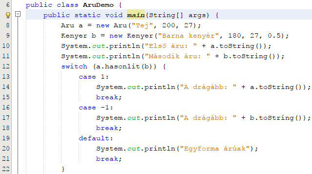
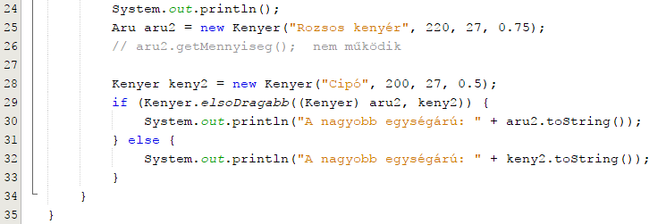

07. Öröklődés 2.
================

Ismétlő kérdés: Mi a különbség a primitív és a referenciaváltozók
között?

Referencia változók értékei
---------------------------

Az előző leckében már említettük a helyettesíthetőség elvét: egy
leszármazott osztály mindent tud, amit az őse tud, tehát használható
minden olyan helyen, ahol az őse használható.

Ennek gyakorlati megvalósítása az, hogy egy referencia változó értékül
nem csak olyan típusú objektumnak tudja felvenni a referenciáját, mint a
referencia típusa, hanem bármelyik leszármazott típusának is.

Azaz egy Szulo típusú referencia  változó fel tudja venni értékül egy
Szulo példány referenciáját, de fel tudja venni értékül a Szulo
bármelyik leszármazottjának referenciáját is.

Ha például Szulo gyermeke Gyermek, akkor

Szulo a = new  Gyermek();

lehetséges.

Vagy például az Aru és Kenyer osztályokat nézve

Aru b = new Kenyer(\...);

lehetséges.

Egy Object típusú referencia például bármilyen típusú objektumnak fel
tudja venni a referenciáját, hiszen az Object minden osztálynak az őse.

A helyettesíthetőség gyakorlati haszna az, hogy a kódunk valójában nem
egy konkrét típussal dolgozik, hanem egy adott típussal és annak
bármelyik leszármazottjával.

Például az Aru osztályban levő hasonlit() metódus, amelynek paramétere
egy Aru típusú referencia, nem csak Aru típusú példánnyal képes
összehasonlítani az aktuális példányt, hanem bármelyik Aru
leszármazottal is, hiszen a paraméter egy referencia, amely fel tud
venni értékül leszármazott típust is.

Aru a = new Aru(\...);\
if (a.hasonlit(new Aru(\...)) == 1) \...;\
if (a.hasonlit(new Kenyer(\...)) == 1) \...;

Referencia változók típusai
---------------------------

Amikor azt mondjuk, hogy a referencia változó típusa, akkor kétféle
típusra gondolhatunk: az a típus, amelyre a változót definiáltuk, és a
hivatkozott objektum típusa. Az elsőt elnevezik a referencia változó
statikus típusának, a másodikat a referencia változó dinamikus
típusának.

Tehát még egyszer:

-   a referencia változó statikus típusa az a típus, amelyre a változót
    > definiáljuk,

-   a referencia változó dinamikus típusa a hivatkozott objektum típusa.
    > Ha a referencia változó nem hivatkozik semmire (értéke null),
    > akkor nincs dinamikus típusa.

Például:

Aru a = new Aru(\...);

esetén az a változó statikus és dinamikus típusai is Aru.

Aru b = new Kenyer(\...);

esetén a b változó statikus típusa Aru és dinamikus típusa Kenyer.

A dinamikus típus képes megváltozni, hiszen egy változó kaphat új
értéket:

b = new Aru(\...);

esetén a b dinamikus típusa megváltozott: a korábbi Kenyer helyett most
Aru lett.

Fontos, hogy a java fordító a referencia változók statikus típusa
alapján ellenőrzi, hogy az objektumnak milyen metódusai vannak.

Például:

Aru a = new Kenyer(\...);\
double m = a.getMennyiseg(); // hibás

nem lehetséges, mert az a statikus típusa Aru, és az Aru típusnak nincs
getMennyiseg() metódusa. Annak ellenére nem lehetséges, hogy a változó
valójában egy Kenyer-re mutat és a Kenyer típusnak van ilyen metódusa.

Ennek értelme az, hogy ha egy Aru típusú referenciának értékül adhatok
bármit, ami Aru leszármazott, akkor csak azokat a funkcióit lehet
használni, ami már Aru-ban is létezett, mert az biztos van minden
leszármazottnak.

Vagy másképpen, ha egy Kenyer-rel helyettesítem az Aru-t, akkor a
Kenyer-re most Aru-ként tekintek.

Az instanceof operátor
----------------------

Létezik a Java nyelvben egy operátor, amellyel le lehet ellenőrizni egy
referencia változó dinamikus típusát. Ez az instanceof operátor, amely
kétoperandusú, logikai értékű operátor.

Szintaktikája:

refvaltozo instanceof tipus

Értéke igaz, ha a refvaltozo dinamikus típusa a megadott tipus vagy
annak leszármazottja.

Például:

Aru a = new Kenyer(\...);

esetén az

a instanceof Aru értéke igaz,\
a instanceof Kenyer igaz,\
a instanceof Object igaz,\
a instanceof String hamis.

Aru b = new Aru(\...);

esetén az

a instanceof Aru igaz,\
a instanceof Kenyer hamis,\
a instanceof Object igaz.

(Persze bármi instanceof Object igaz értékű, hiszen minden Object
leszármazott.)

Referencia változó konverziói
-----------------------------

**Automatikus konverzió:**

Egy referencia változó képes automatikusan konvertálódni a *statikus*
típusa ősévé.

Például:

Kenyer a = new Kenyer(\...);\
Aru b = a;\
Object c = a;

Automatikus konverziónál nem számít a dinamikus típus.

Például:

Aru a = new Kenyer(\...);\
Kenyer b = a; // nem lehetséges

**Kikényszerített konverzió:**

Egy referencia változó kényszerítéssel átalakítható a változó
*dinamikus* típusává vagy annak ősévé.

Például:

Aru a = new Kenyer(\...);\
Kenyer b = (Kenyer)a;

vagy

Object a = new Kenyer(\...);\
Aru b = (Aru)a;\
Kenyer c = (Kenyer)a;

Nem lehetséges viszont:

Aru a = new Aru(\...);\
Kenyer b = (Kenyer)a; // nem lehetséges

Feladat
-------

Folytatjuk az előző leckében elkezdett feladatot. Legutóbb definiáltunk
egy általános Aru osztályt, majd ennek leszármazottjaként egy
speciálisabb Kenyer osztályt. Most az AruDemo osztályt fogjuk
elkészíteni, amely használja az Aru és a Kenyer osztályokat.

1.  Indítsd el a NetBeans programot, és nyisd meg az AruDemo projektet!

2.  Írd be a main metódusba az alábbiakat:\
    {width="6.65625in"
    height="3.7083333333333335in"}\
    Figyeld meg, hogy egy Aru és egy Kenyer típusú változót hasonlítunk
    össze!

3.  Ezután hozz létre egy olyan változót (aru2), amelynek különböző a
    statikus és a dinamikus típusa, és próbáld ki a működését:\
    {width="7.5625in"
    height="2.6145833333333335in"}\
    Figyeld meg, hogy a 28. sorban kényszerített típuskonverziót kell
    alkalmazni! Miért?

A következő leckében folytatjuk.
