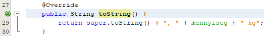
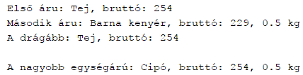

08. Öröklődés 3.
================

Metódusok öröklése

A gyerek osztály örökli ősei metódusait, módosíthatja az örökölt
metódusokat, és definiálhat újakat is.

Nézzük meg, hogy ha a gyermek osztályban definiálunk egy metódust, akkor
milyen esetek léteznek!

**1. Új metódust definiálunk:**

Olyan metódust hozunk létre, amelynek neve nem egyezik meg egyik örökölt
metóduséval sem. Vagy olyan metódust definiálunk, amely neve ugyan
megegyezik egy ősbelivel, de ebben az osztályban az nem látható. Például
az ősben van egy private metódus, akkor a leszármazottban is lehet egy
ugyanolyan nevű private metódus és az újnak számít.

**2. Meglevő metódust túlterhelünk (overload):**

Olyan metódust hozunk létre, amelynek neve megegyezik egy meglévő
metóduséval (örökölte vagy ebben az osztályban definiáltuk), de a
paraméterek típussorrendje eltér attól. Például örökölt egy int met1()
metódust és definiálunk egy int met1(int) metódust.

**3. Örökölt metódust felüldefiniálunk (override):**

Ezzel módosíthatunk egy örökölt metódust. A metódus tehát ugyanazt a
funkciót látja el, mint a szülőbeli, csak másképpen, azaz más a kódja.

Például az ősben van ez a metódus:

public void met1() {\
System.out.println(\"aa\");\
}\
és a leszármazottban definiáluk egy másikat:

public void met1() {\
System.out.println(\"bb\");\
}\
Vannak egyéb feltételek is, hogy felüldefiniálásnak számítson:

-   Osztálymetódust nem lehet felüldefinálni (csak elrejteni, ld.
    > következő pont), azaz sem az örökölt metódusnak sem a
    > felüldefiniáló metódusnak nem lehet static módosítója.

-   Az örökölt metódusnak nem lehet final módosítója, mert metódusokra a
    > final módosító azt jelenti, hogy megtiltjuk, hogy a
    > leszármazottakban felüldefiniálják.

-   Csak olyan metódus definiálható felül, amely látható a
    > leszármazottban. Tehát például egy ősbeli private metódus nem.

-   A felüldefiniáló metódusnak a hozzáférése nem lehet szűkebb, mint az
    > ősbeli. Tehát public metódust csak public metódussal lehet
    > felüldefiniálni, protected metódust protected vagy public
    > metódussal, stb.

-   A felüldefiniáló metódus visszatérési értékének típusa ugyanaz kell
    > legyen, mint az ősbeli vagy annak leszármazottja.

-   A felüldefiniáló metódus csak olyan kivételeket dobhat, amelyeket az
    > ősbeli dobott, vagy azok leszármazottjait.

**4. Örökölt osztálymetódust elfedünk (hide):**

Ha egy örökölt osztálymetódussal azonos típussorrendű osztálymetódust
hozunk létre. Az elfedés és felüldefiniálás különbözőségét lásd a
következő szakaszban.

**+1. Hibás definíció:**

Ezek mind fordítási hibát okoznak:

-   Örökölt osztálymetódussal azonos paramétersorrendű példánymetódust
    > hozunk létre.

-   Örökölt példánymetódussal azonos paramétersorrendű osztálymetódust
    > hozunk létre.

-   Örökölt példánymetódussal azonos paramétersorrendű példánymetódust
    > hozunk létre, de a felüldefiniálás valamelyik feltétele nem
    > teljesül.

Metódusok hívása
----------------

**Felüldefiniálás (overriding)**

A felüldefiniálás lényege, hogy módosítunk egy viselkedést. Ha az ős
osztálynak hívjuk meg a metódusát, akkor másképpen fog működni, mint ha
a leszármazottét.

Például, ha az Aru osztályban lenne egy

public void met() {\
System.out.println(\"aa\");\
}

metódus, és a Kenyer osztályban ezt felüldefiniálhatnánk így:

public void met() {\
System.out.println(\"bb\");\
}

Ezután ha egy Aru-ra hívnánk meg a metódust

Aru a = new Aru(\...);\
a.met();

akkor az Aru-beli hajtódik végre, azaz kiírja, hogy \"aa\".

Ha viszont egy Kenyer-re hívjuk meg

Kenyer a = new Kenyer(\...);\
a.met();

akkor a Kenyer-beli hajtódik végre, azaz kiírja, hogy \"bb\".

Tehát a program az alapján dönti el, hogy melyik metódust hívja meg,
hogy milyen típusú referenciával hivatkoztunk rá. De vajon a referencia
melyik típusa alapján dönt: a statikus vagy a dinamikus típusa alapján?

Ha beírnánk a következőt:

Aru a = new Kenyer(\...);\
a.met();

azt látnánk, hogy a \"bb\" íródik ki. Tehát felüldefiniálás esetén
mindig a referencia *dinamikus* típusa alapján dönti el, hogy melyik
metódust hívja meg.

Előfordulhat, hogy a felüldefiniálás nem akarja teljesen megváltoztatni
a működését az ősbelinek, hanem csak kiegészíteni. Ezért lehetőség van
arra, hogy a felüldefiniáló metódusból meghívjuk az ősbeli
felüldefiniáltat, így az abban levő kódot nem kell megismételni a
leszármazottban.

Az ősbeli metódus meghívása nem lehet szimplán a metódus nevével (és
paramétereivel), mert az már nem az ősbeli metódust jelenti, hanem saját
magát, vagyis egy rekurzív hívás lenne.

Ezért a meghívás szintaktikája:

super.metódushívás

Például a Kenyer-beli met nézhetne így is ki:

public void met() {\
System.out.println(\"bb\");\
super.met();

}

Ekkor a \"bb\" kiírása után még meghívja az ősbeli met()-et is, ami
kiírja az \"aa\"-t.

**Elfedés (hiding)**

Osztálymetódusok esetén nem referencián keresztül szokás a metódusra
hivatkozni, hanem osztálynévvel. Így mindig egyértelmű, hogy melyik
metódusra hivatkozunk éppen.

Például legyen az Aru osztályban:

public static void smet() {\
System.out.println(\"aa\");\
}

A Kenyer osztályban definiálunk az Aru-beli metódussal azonos
paramétersorrendű osztálymetódust, vagyis elfedjük:

public static void smet() {\
System.out.println(\"bb\");\
}

Természetesen Aru.smet() az Aru-belit hívja meg, Kenyer.smet() pedig a
Kenyer-belit.

Ha a példány nevével hívjuk meg a statikus metódust:

Aru a = new Aru(\...);\
Kenyer b = new Kenyer(\...);\
Aru c = new Kenyer(\...);

esetén a.smet() az Aru-belit, b.smet() a Kenyer-belit, viszont c.smet(),
a felüldefiniálással ellentétben, szintén az Aru-belit hívja meg.
(Vagyis itt a statikus típus számít.)

A metódushívások módja
----------------------

Amikor egy programozási nyelvben egy metódushívás történik, akkor a
fordító megkeresi a metódust, amit meghívtak, és a lefordított kódba a
függvény címére való ugrást utasítást ír.

Amikor viszont egy Java fordító fordítja az Aru osztályt, és azon belül
a met() hívást, akkor ezt még nem tudja megtenni. Ennek oka, hogy
ugyanannak a metódusnak a végrehajtásakor hol az Aru-beli metódust kell
meghívnia, hol a Kenyer-belit.

Ez csak futtatáskor derül ki, amikor már be van töltve az összes
érintett osztály és látja a referenciát, amelyre a metódus hívás
történik.

Azt a mechanizmust, amikor csak futtatás közben lehet megállapítani egy
meghívott metódusnak a címét, *késői kötés*nek nevezzük.

*Korai kötés*nek pedig azt nevezzük, amikor már a fordító meg tudja adni
a címet.

A Java nyelvben a példánymetódusok hívása a késői kötés mechanizmusával
működik, míg az osztálymetódusoké a korai kötés mechanizmusával.

Annotáció
---------

Amikor felüldefiniálunk egy metódust, akkor a NetBeans jelzi, hogy
célszerű elé odaírni az \@Override annotációt.

Az annotáció a fordítónak szól. Jelentése: kényszeríti a fordítót, hogy
ellenőrizze le, hogy a szülő osztályban van-e olyan metódus, amelynek ez
a felüldefiniálása.

Hasznos lehet egyszemélyes munkánál is az elgépelések megelőzésére, de
csapatmunkánál különösképpen hasznos.

Például előfordulhat, hogy a toString felüldefiniálásakor véletlenül
toString helyett tostring nevet adunk a metódusnak, amellyel felül
akarjuk defininiálni a szülőtől örökölt toString-et.

Ha nincs annotáció, akkor a fordító nem tudja jelezni a hibát, hiszen
azt hiszi, hogy új metódust definiálunk tostring néven. A metódus
hívásakor sincs hibaüzenet, hiszen a leszármazott örökölte a szülőtől a
toString metódust, csak éppen csodálkozhatunk, hogy miért nem a
leszármazottbeli hívódott meg, hanem az ősbeli.

Ha viszont kiírjuk a \@Override-ot a tostring elé, akkor a fordító
rögtön jelzi, hogy a szülőben nincs tostring metódus, tehát rögtön
látjuk a hibát.

Az annotáció használata nem kötelező, de ajánlott.

Feladat
-------

Most befejezzük az előző leckékben elkezdett feladatot. Elkészítjük a
Kenyer osztály toString() metódusát.

1.  Indítsd el a NetBeans programot, és nyisd meg az AruDemo projektet!

2.  Nyisd meg a Kenyer osztályt, és írd be a toString() metódusát!\
    {width="5.447916666666667in"
    height="0.7604166666666666in"}

3.  Futtasd le az AruDemo osztályt! Figyeld meg, hogy a kenyereknél
    kiírja a mennyiséget is:\
    {width="4.458333333333333in"
    height="1.1145833333333333in"}
